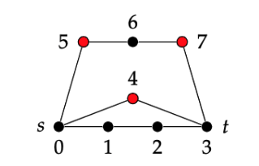
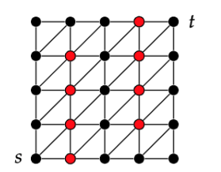
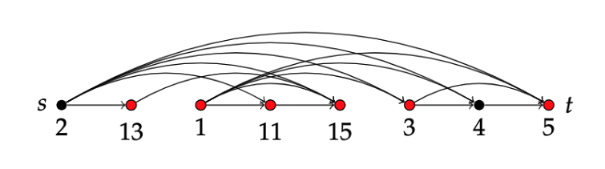
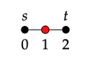
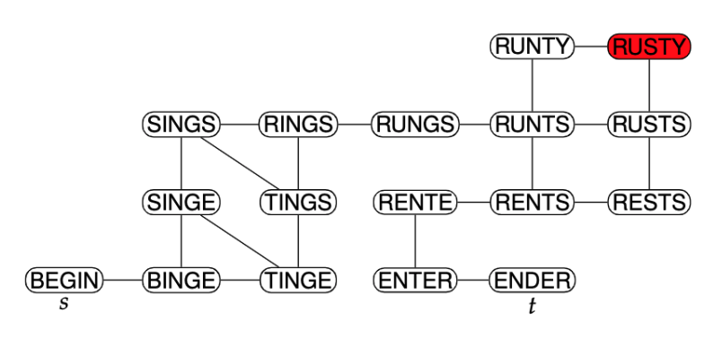
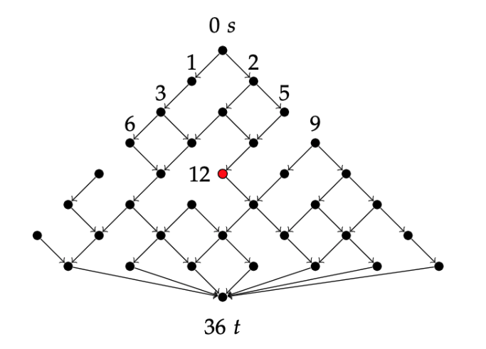

# Example data


## Graphs
The provided example graphs are a subset of graphs from the [red-scare](https://github.com/thorehusfeldt/algdes-labs/tree/master/red-scare/data) assignment (Algorith Design at ITU), but without the red vertices. 

All the input files follows the format:

```
n m
s t
<vertices>
<edges>
```
where `n` represents the number of vertices and `m` representes the number of edges. Additionally `s` represents the source vertex while `t` represents the target vertex.

`<vertices>` is a list of vertex names, one per line.

`<edges>` is a list of edges, either undirected:
```
u -- v
```
or directed:
```
u -> v
```


### Images of the example graphs:
#### G-ex.txt


#### grid-5-0.txt


#### increase-n8-1.txt


#### P3.txt


#### rusty-1-17.txt


#### ski-illustration.txt
